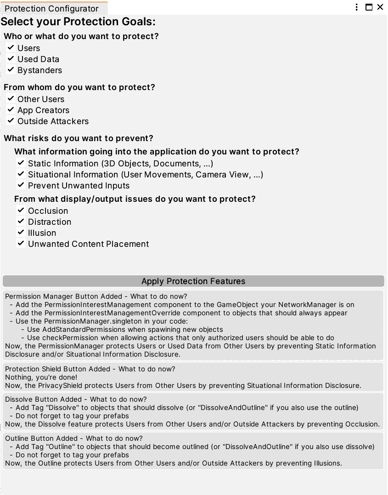

  
  
#  
TARPS is a Unity toolbox enhancing collaborative AR applications with privacy and security. It enables Unity developers without prior education in privacy and security to add protection features directly into an existing application. To do so, developers can use a UI to choose from a selection of pre-defined protection features which are then integrated into the application the TARPS package was added to. These features work mostly out-of-the-box and TARPS provides instructions in case additional integration steps are necessary.
## Content
* [Features](#features)
* [Instructions](#instructions)
  * [Importing TARPS](#importing-tarps)
  * [Using TARPS](#using-tarps)
      * [Developer UI](#developer-ui)
      * [Protection Features](#protection-features)
          * [Permission Menu](#permission-menu)
          * [Privacy Shield](#privacy-shield)
          * [Dissolve](#dissolve)

## Features
TARPS works on two levels: in Unity, it offers a developer UI for choosing and applying protection features. The protection features can then be used on the end-user level in the finished application. In the [Instructions](#instructions) section, we will go through these levels and features in more detail.

The following video shows the UI and features in more detail:

https://github.com/S-Krings/TARPS/assets/61807632/b61046b6-7805-497c-8b12-1874b535f200

A version with higher resolution can be found in the [Documentation](/Supplementary_Material/Documentation/Figures) folder.

## Instructions
### Importing TARPS
* To import TARPS into your project, download the fitting .unitypackage from the [Packages](/TARPS_Packages/) folder. You have two options:
  * Download only [TARPS without its Dependencies](TARPS_Packages/TARPS_noDependencies.unitypackage) if you already have MRTK, Mirror, and TextMesh Pro in your project
  * Download [TARPS with its Dependencies](TARPS_Packages/TARPS_withDependencies.unitypackage) if you want to import TARPS with all its dependencies at once
* Then import it into Unity: 
  * Select 'Assets > Import Package > Custom Package...' 
  * Choose your downloaded .unitypackage
  * Click 'Import' to import TARPS into your project
### Using TARPS
#### Developer UI
When you have imported TARPS, you can open the developer UI by selecting 'TARPS > Open Protection Configurator Window'. You will something similar to the window below:

To use TARPS to include privacy and security, you only have to:
* Select which protection you want to include (or just leave everything checked)
* Open the scene of your application in which the protection features should be included
* Click 'Apply Protection Features'
A GameObject called "HandProtectionMenu" will be added to your scene. It can be opened by application users by turning the palm of their hand towards their face and contains buttons for all the protection features that relate to your selected privacy and security specifications.

Below the 'Apply Protection Features' button, the developer UI will show you which protection features have been added and if there are any further steps you need to take. We will go into these steps per feature in the next section.
#### Protection Features
##### Permission Menu
In the permission menu, users can select which permissions other users have to their created content. The standard options are 'None', 'View', 'Edit', and 'Delete'. The options are applied to everything created after saving a new setting. With 'None' rights, objects are not sent to the corresponding user’s instance at all so they do not show up for that user. The 'View' rights level allows the other user to view the objects, but not to do anything more. The next level, 'Edit' lets the corresponding user view and edit the object, allowing them to move and scale, but not delete it. This is only possible with the highest level of authority: 'Delete', which gives the users permission to all interactions with the object. In the application, it will by default look like this:

As a developer, to use the Permission Manager, you have to connect it to your code for controlling networked objects in two steps: 
* When spawning networked objects, you have to call 'PermissionManager.singleton.AddStandardPermissions(gameObject)' with the new object as a parameter to add the new object to the permission management.
* In your code for editing or deleting objects, you need to check if the user has the permission to do so. For this, you should use 'PermissionManager.singleton.checkPermission(permissionType, gameObject, clientID)' with the fitting PermissionType, the object, and the Mirror client ID of the user.
##### Privacy Shield
The privacy shield spawns as a box around the user. From the inside, users can see their surroundings, but from the outside, the shield is opaque, as shown in the picture below. The user owning the shield can choose who is allowed to enter the privacy shield and users who enter without permission will trigger an alarm sound and will be shown a warning message. If an intruding user does not leave the privacy shield on their own, they will be removed from the Mirror instance.

As a developer, you do not have to change anything, the privacy shield works fully out of the box.
##### Dissolve
The dissolve feature is meant to prevent too much occlusion. When an object is very large or very close to a user and would cover up (nearly) their full view, it enables the user to see through the object by (visually) dissolving it, as shown in the picture below. This effect is only visual, the object itself stays intact. If the dissolve feature is activated, the dissolve effect will trigger itself if a situation with too much occlusion happens.

To make it possible to dissolve objects, you, the developer, have to mark them with the 'Dissolve' [Tag](https://docs.unity3d.com/Manual/Tags.html) in Unity. This is so TARPS does not accidentally apply the dissolve effect to objects you do not want to be dissolved, such as, for example, the privacy shield.
